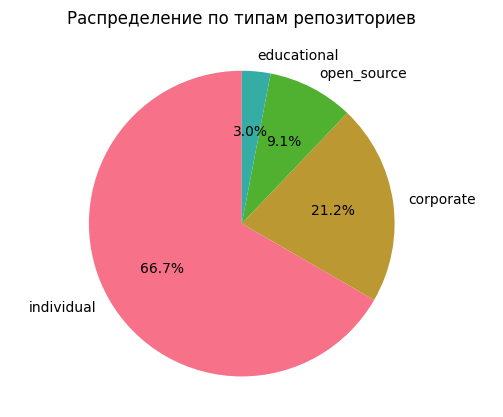
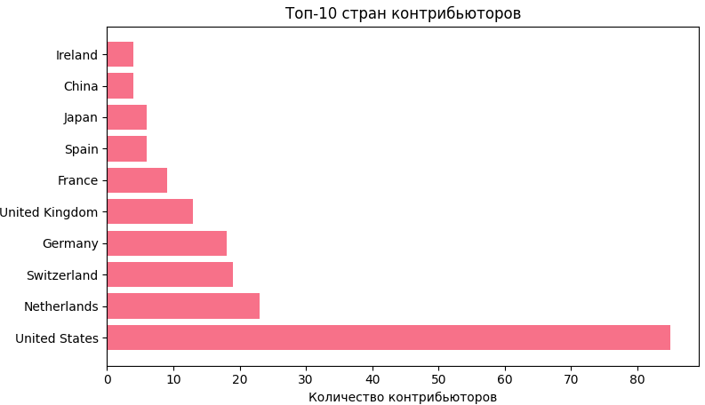
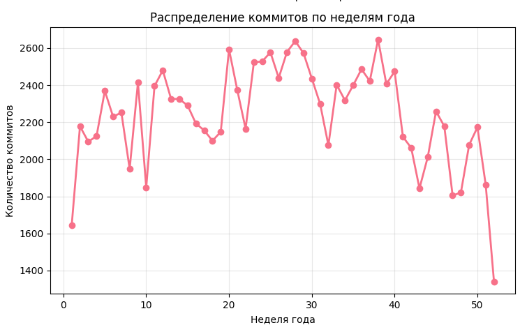

## Общая статистика

| Показатель | Значение |
|------------|----------|
| Уникальных репозиториев | 33 |
| Уникальных контрибьюторов | 327 |
| Всего коммитов в датасете | 228113 |

## Распределение по типам репозиториев

| Тип | Количество | Процент |
|-----|------------|---------|
| individual | 22 | 66.7% |
| corporate | 7 | 21.2% |
| open_source | 3 | 9.1% |
| educational | 1 | 3.0% |

## Распределение по странам контрибьюторов

| Страна | Количество | Процент |
|--------|------------|---------|
| United States | 85 | 26.0% |
| Netherlands | 23 | 7.0% |
| Switzerland | 19 | 5.8% |
| Germany | 18 | 5.5% |
| United Kingdom | 13 | 4.0% |
| France | 9 | 2.8% |
| Spain | 6 | 1.8% |
| Japan | 6 | 1.8% |
| China | 4 | 1.2% |
| Ireland | 4 | 1.2% |

## Распределение по количеству коммитов на контрибьютора

| Диапазон коммитов | Количество | Процент |
|-------------------|------------|---------|
| 51-100 | 1 | 0.6% |
| 101-500 | 90 | 52.0% |
| 501-1000 | 41 | 23.7% |
| 1000+ | 41 | 23.7% |

## Распределение коммитов по неделям года

| Неделя | Коммиты | Процент |
|--------|---------|---------|
| 1 | 1644 | 1.4% |
| 2 | 2178 | 1.9% |
| 3 | 2095 | 1.8% |
| 4 | 2125 | 1.8% |
| 5 | 2369 | 2.0% |
| 6 | 2230 | 1.9% |
| 7 | 2252 | 1.9% |
| 8 | 1948 | 1.7% |
| 9 | 2415 | 2.1% |
| 10 | 1848 | 1.6% |
| 11 | 2395 | 2.1% |
| 12 | 2480 | 2.1% |
| 13 | 2326 | 2.0% |
| 14 | 2325 | 2.0% |
| 15 | 2290 | 2.0% |
| 16 | 2193 | 1.9% |
| 17 | 2156 | 1.8% |
| 18 | 2100 | 1.8% |
| 19 | 2148 | 1.8% |
| 20 | 2593 | 2.2% |
| 21 | 2373 | 2.0% |
| 22 | 2165 | 1.9% |
| 23 | 2523 | 2.2% |
| 24 | 2528 | 2.2% |
| 25 | 2577 | 2.2% |
| 26 | 2439 | 2.1% |
| 27 | 2579 | 2.2% |
| 28 | 2638 | 2.3% |
| 29 | 2572 | 2.2% |
| 30 | 2436 | 2.1% |
| 31 | 2299 | 2.0% |
| 32 | 2076 | 1.8% |
| 33 | 2402 | 2.1% |
| 34 | 2318 | 2.0% |
| 35 | 2400 | 2.1% |
| 36 | 2486 | 2.1% |
| 37 | 2422 | 2.1% |
| 38 | 2646 | 2.3% |
| 39 | 2406 | 2.1% |
| 40 | 2474 | 2.1% |
| 41 | 2121 | 1.8% |
| 42 | 2062 | 1.8% |
| 43 | 1843 | 1.6% |
| 44 | 2012 | 1.7% |
| 45 | 2259 | 1.9% |
| 46 | 2178 | 1.9% |
| 47 | 1805 | 1.5% |
| 48 | 1820 | 1.6% |
| 49 | 2078 | 1.8% |
| 50 | 2173 | 1.9% |
| 51 | 1862 | 1.6% |
| 52 | 1339 | 1.1% |
| 53 | 145 | 0.1% |

Самые активные недели: 38, 28, 20  
Среднее коммитов в неделю: 2199.4